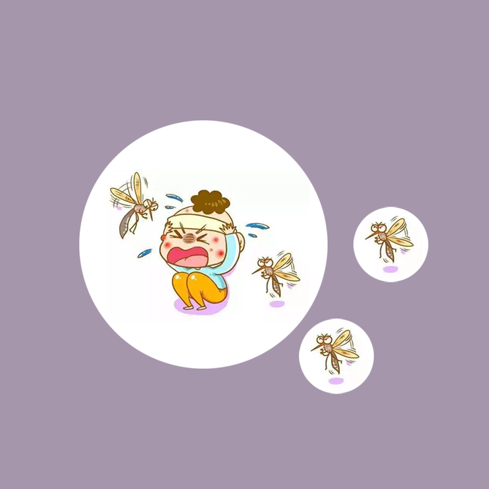

## 欢迎来到 Baby Away Mosquito Bites

在日常生活中，经常会遇到婴儿宝宝被蚊子叮咬的烦恼，我们作为家长需要特别注意和关心婴儿宝宝，让宝宝尽量避免和远离蚊子叮咬的烦恼。我们可以利用这款应用，记录宝宝被蚊子叮咬的情况，被叮咬的地点和我们当时采取的改善措施。当宝宝出现被蚊子叮咬的情况时，我们可以联系其他家庭成员，一起商量如何改善蚊子的情况，让宝宝健康成长。

如果您遇到什么需要解答的问题，请发送您的问题到以下邮箱。

我们将第一时间为您解答。

### 邮箱地址: zhanghesongyuan7@126.com

谢谢！
